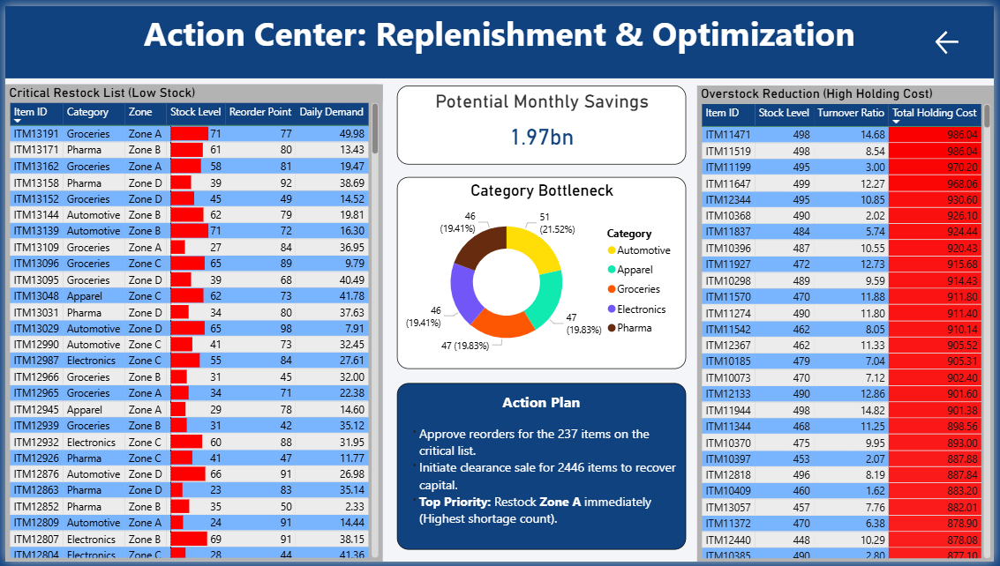

# 📦 Supply Chain & Inventory Analysis - Power BI

## 📝 Project Overview
This project analyzes inventory data across multiple warehouses to address two critical issues: **stock-outs** causing delayed deliveries and **overstocking** leading to high holding costs. The dashboard acts as a "Control Tower," visualizing key metrics like inventory turnover, stock status, and warehouse performance to optimize supply chain efficiency.

**Dataset Used:** [Logistics Warehouse Dataset (Kaggle)](https://www.kaggle.com/datasets/ziya07/logistics-warehouse-dataset)

## 📷 Dashboard Screenshots

### 1. Supply Chain Control Center (Executive View)

*Provides a high-level health check: **$89.57M** in total inventory value, **15,000** stockouts, and a **76%** overstock rate.*

### 2. Action Center (Replenishment & Optimization)

*A split-view operational tool: The **Left Panel** lists products requiring immediate reordering (Low Stock), while the **Right Panel** identifies "Cash Traps" (High Holding Cost items) for liquidation.*

## 🔑 Key Insights
* **Inventory Imbalance:** A staggering **76.34%** of inventory is classified as **Overstocked**, tying up significant working capital, while only **7.4%** is in the "Low Stock" critical zone.
* **Service Level Risk:** Despite massive inventory levels, the company faced **15,000 stockouts**, indicating a mismatch between supply and actual demand.
* **Zone Hotspots:** **Zone D** holds the highest volume of excess stock (~203K units), followed closely by Zone A, making them prime targets for inventory redistribution.
* **Category Analysis:** **Automotive** products have the highest daily demand (Avg 26.0), while **Electronics** are slow-moving with high stock levels, requiring clearance strategies.
* **Financial Impact:** Top slow-moving items are incurring holding costs of nearly **$980/day** per item, necessitating immediate liquidation.

## 🛠️ Tools Used
* **Power BI Desktop** (Data Modeling, DAX, Visualization)
* **Power Query** (ETL & Data Cleaning)
* **DAX Measures** (Calculated Stock Status, Turnover Ratios, shortage counts)

## 🚀 How to View
1.  Download the `.pbix` file from this repository.
2.  Open in **Microsoft Power BI Desktop**.
3.  Navigate between the "Executive Overview" and "Action Center" pages to explore the insights.
